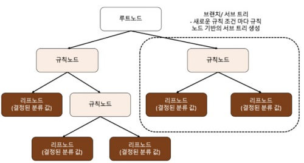
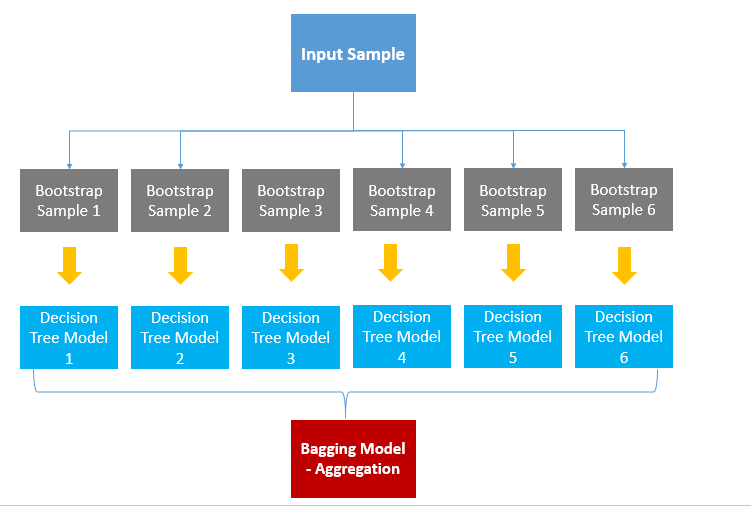

**K-최근접 이웃(K-nearest neighbor)**

- 새로운 입력을 받았을 때 기존 클러스터에서 모든 데이터와 인스턴스 기반 거리를 측정하고 가장 많은 속성을 가진 클러스터에 할당하는 분류 알고리즘.

 

 

**서포트 벡터 머신(Support Vector Machine)**

- 분류를 위해 기준선을 정의해 결정 경계(기준선)를 기준으로 어디에 속하는지 분류하는 모델.
- 서포트 벡터(support vector) : 결정 경계와 가까이 있는 데이터들.
- 마진(margin) : 결정 경계와 서포트 벡터 사이의 거리.
- 최적의 결정 경계는 마진을 최대로 해야함.
- SVM은 선형 분류와 비선형 분류를 지원하며 비선형 분류를 위해 커널 트릭(kernel trick)이 존재.
- 선형 분류를 위해서 선형 커널(linear kernel)을 사용하고 비선형 분류를 위해 다항식 커널(polynomial kernel)과 가우시안 RBF 커널(Gaussian RBF kernel)을 사용.

 

 

**결정 트리(Decision tree)**

- 트리 구조로 데이터를 분류하는 모델.
- 데이터 스케일에 대한 전처리 작업을 할 필요가 없음.
- 1차 분류 후 순도(homogeneity)는 증가하고 불순도(impurity)와 불확실성(uncertainty)는 감소하는 방향으로 학습을 진행함.
- 순도를 계산하는 방법에는 엔트로피(entropy)와 지니 계수(Gini index)가 있음.
- 엔트로피 : 불확실성을 수치로 나타낸 것으로 엔트로피가 높을수록 불확실성이 높음. 불확실성이 낮으면 순도가 높은 것.
- 지니 계수 : 불순도를 측정하는 지표로 원소 n개중 임의로 2개를 추출했을때 추출된 2개가 다른 그룹에 속할 확률을 의미. 노드에 하나의 클래스만 있다면 지니 계수가 0으로 순도가 가장 높고 불순도가 낮은 것.
- scikit-learn에서 from sklearn.tree import DecisionTreeClassifier

 

 

**로지스틱 회귀(Logistic regression) **

- 각 집단에 속할 확률을 예측하고 분류 기준값에 따라 특정 범주로 분류하는 모델.

- 선형 회귀처럼 선형 방정식을 사용한 분류(classification).
- 선형 회귀의 계산 값을 0 ~ 1 사이의 값으로 압축.
- 이진 분류에서는 하나의 선형 방정식을 학습하고 출력값을 시그모이드 함수에 통과시켜 0 ~ 1 사이의 값을 만듦(해당 값이 양성 클래스일 확률).
- 다중 분류에서는 클래스 개수만큼 선형 방정식을 학습하고 각 방정식의 출력값을 소프트맥스 함수에 통과시켜 전체 클래스에 대한 합이 1이 되도록 만듦(해당 값이 각 클래스일 확률).

- 계수의 제곱을 규제하는데 이를 L2 규제라고도 함.
- 매개변수 C 값이 작으면 규제가 커짐.
- scikit-learn에서 from sklearn.linear_model import LogisticRegression

 

 

**앙상블 학습(Ensemble Learning)**

여러 모델을 학습시키고 각 모델의 예측을 취합해 최종 결과를 만드는 머신러닝 알고리즘.

배깅(Bagging) 방법과 부스팅(Boosting) 방법이 있음.

 

 

**배깅(Bagging)**

Bootstrap Aggregation의 약자로 부트스트랩 샘플로 학습시킨 모델의 결과들을 집계(Aggregation)하는 방법.

분류일 경우 투표 방식(Voting)으로 결과를 집계하며 회귀일 경우 평균으로 집계.

병렬 구조로 학습.

 

 

**부스팅(Boosting)**

가중치를 활용해 약 분류기(weak classifier)를 강 분류기(strong classifier)로 만드는 방법.

처음 모델의 예측 결과에 따라 가중치가 부여되고 부여된 가중치는 다음 모델에 영향을 줌.

잘못 예측한 데이터에 집중해 큰 가중치를 부여하고 정확히 예측한 데이터에는 작은 가중치를 부여해 잘못 예측한 데이터를 다음 모델에서는 정확하게 예측할 수 있도록 함.

순차적으로 학습.

배깅 방법에 비해 성능이 좋지만 속도가 느리고 과적합 될 가능성이 있음.

 

 

**랜덤 포레스트(Random Forest)**

앙상블 학습의 한 종류.

결정 트리를 랜덤으로 만들어 숲을 만들고 각 결정 트리의 예측을 사용해 최종 예측을 만듦.

각 트리를 학습시키기위해 학습 데이터에서 랜덤으로 데이터를 추출함(중복될 수 있음).

부트스트랩 샘플(bootstrap sample) : 랜덤으로 데이터를 추출해 만든 샘플.

OOB 샘플(Out of Bag sample) : 부트스트랩 샘플에 포함되지 못한 샘플.

트리의 노드를 만들때 전체 특성 중 무작위로 일부 특성을 선정해 최선의 분할을 찾음.

분류 모델인 RandomForestClassifier는 특성 개수의 제곱근만큼의 특성을 선택.

회귀 모델인 RandomRorestRegressor는 전체 특성을 사용.

 
 

**엑스트라 트리(Extra Tree)**

앙상블 학습의 한 종류.

랜덤 포레스트와 유사하지만 부트스트랩 샘플을 사용하지 않고 전체 학습 데이터셋을 사용한다는 차이가 있음.

트리의 노드를 만들때 최선의 분할을 찾는 것이 아니라 무작위로 분할.

 

 

**그레디언트 부스팅(Gradient Boosting)**

앙상블 학습의 한 종류.

scikit-learn의 GradientBoostingClassifier는 깊이가 3인 결정 트리를 100개를 사용.