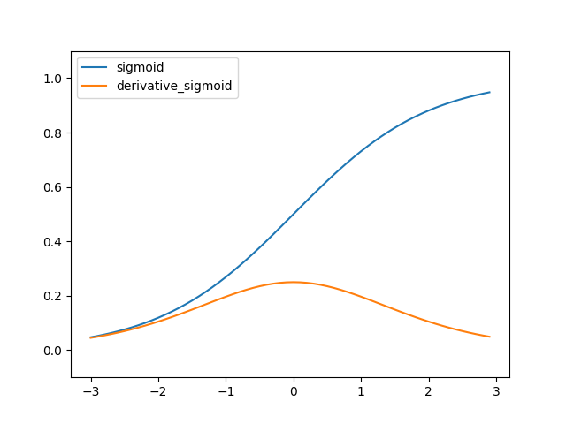
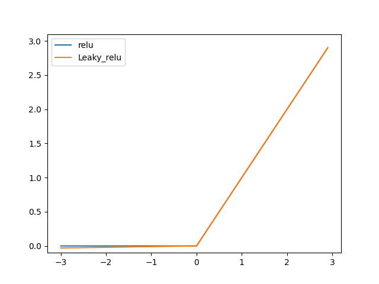
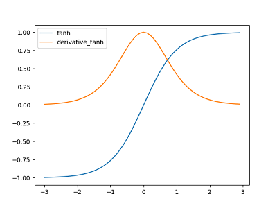

**활성화 함수(activation function)**

- 입력 신호의 총합을 출력 신호로 변환하는 함수
  1. 시그모이드(sigmoid function)
  2. 렐루(Relu:Rectified Linear Unit function)
  3. 소프트 맥스(softmax function)

 

 

**시그모이드(sigmoid)**

- #### $f(x) = 1 / (1 + e^{-x})$

- 결과값이 0에서 1사이로 미분한 최대값이 0.25임.
- 오차역전파 과정에서 은닉층의 깊이가 깊으면 가중치가 업데이트 되지않고 소실되는 기울기 소실(gradient vanishing)이 발생할 수 있음.
- 이진 분류 문제에서 사용.

 

 

**렐루(Relu), 리키 렐루(Leaky Relu)** 

- relu : f(x) = max(0, x)
- 시그모이드의 단점인 기울기 소실 문제를 해결하였으며 성능이 좋음.
- 0보다 작은 값들에서 뉴런이 죽을 수 있다는 단점이 있음(Dying Relu).

 

- leaky relu : f(x) = max(0.01x, x)
- Dying Relu 문제를 해결한 함수로 relu보다 잘 된다고 함.

 

 

**소프트맥스(softmax)**

* #### $e^{zi} \over \displaystyle\sum_{j=1}^{k}{e^{zj}}$

- 출력값이 0~1사이로 정규화되며 모든 출력값의 합이 1이 됨.
- 다중 분류 문제에서 사용.

 

 

**하이퍼볼릭 탄젠트(hyperbolic tangent, tanh)**

* #### $sinhx \over coshx$ = $e^x - e^{-x} \over e^x + e^{-x}$

* -1~1 사이의 값을 출력하며 중앙값이 0.

* 미분했을때 최대값이 1.