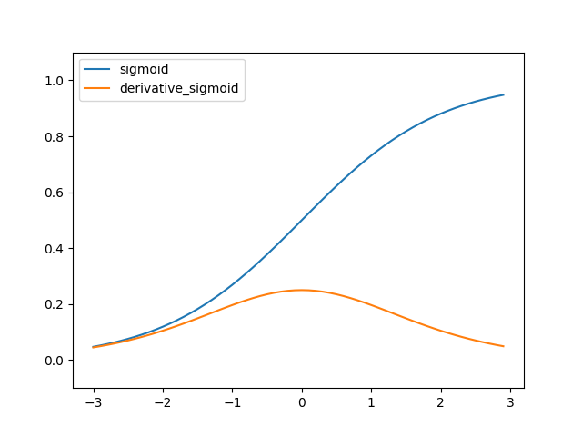
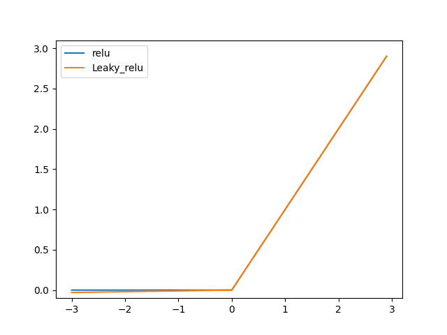

# CNN

#### 퍼셉트론

* 가중치는 입력 신호가 결과에 주는 영향력을 조절하는 매개변수.

* 편향은 얼마나 쉽게 활성화하는지를 조절하는 매개변수.

* 단층 퍼셉트론은 비선형 영역을 분리할 수 없음(다층 퍼셉트론은 가능).

 

 

#### 신경망

* 뉴런이나 노드로 구성된 인공 신경망을 의미

* 가중치 매개변수를 자동으로 학습함.

* 입력층 -> n개의 은닉층 -> 출력층.

* 활성화 함수(activation function) : 입력 신호의 총합을 출력 신호로 변환하는 함수(비션형 함수).
  * 시그모이드 함수(sigmoid funcion) : h(x) = 1/(1+exp(-x)) -> 1/(1+np.exp(-x)), 회귀에 주로 사용.
  
    
  
     
  
  * ReLU 함수(Rectified Linear Unit function) : h(x) = x(x>0), 0(x<=0)
  
    
  
     
  
  * 소프트맥스 함수(softmax function) : 입력 신호의 지수 함수/모든 입력 신호의 지수 함수의 합, 출력이 0~1.0 사이의 실수로 출력의 총합이 1 -> 문제를 확률적(통계적)으로 대응 가능해 분류에 주로 사용.

  

#### 신경망 학습

* 학습 : 훈련 데이터로부터 가중치 매개변수의 최적값을 자동으로 획득하는 것.
* 오버피팅(overfitting) : 특정 데이터셋에만 최적화되어 다른 데이터셋에서는 효과적이지 않은 상태.
* 손실 함수(loss function), 비용 함수(cost function) : 가중치 매개변수의 최적값(손실 함수 값이 최소가 될 때)을 찾도록 만들어주는 함수.
  * 오차 제곱합(SSE : Sum of squares for error) : 0.5*np.sum((y-t)**2)     #y는 신경망의 출력, t는 정답 레이블
  * 교차 엔트로피 오차(CCE : cross entropy error)
* 경사법(gradient method) : 현 위치에서 기울어진 방향으로 일정 거리만큼 이동하고 이동한 곳에서도 기울기를 구해 기울어진 방향으로 나아가기를 반복해 함수의 값을 줄이는 방법으로 최소값을 찾는 경사 하강법(gradient descent method)를 주로 사용.
  * 학습률(learning rate) : 매개변수 값을 얼마나 갱신하는지를 정함.
  * 기존의 시작점에서 기울기*학습률만큼 이동하는데 학습률이 작다면 작은 보폭으로 이동해 시간이 오래걸리지만 학습률이 크다면 큰 보폭으로 이동해 정확한 학습을 하기 어려움.
  * 확률적 경사 하강법(SGD, stochastic gradient descent) : 확률적으로 무작위로 골라낸 데이터에 대해 수행하는 경사 하강법.
* 파라미터(parameter) : 훈련 데이터와 학습 알고리즘에 의해 자동으로 획득되는 가중치 매개변수나 편향.
* 하이퍼 파라미터(hyper parameter) : 사람이 직접 설정해야하는 매개변수로 학습률이 있음.

 

 

#### 오차역전파법(back-propagation)

* 가중치 매개변수의 기울기를 효율적으로 계산하는 방법.

 

 

#### 매개변수 갱신

1. 확률적 경사 하강법(SGD) : 비등방성 함수(방향에 따라 성질이 달라지는 함수)에서의 탐색이 비효율적.
2. 모멘텀
3. AdaGrad : 처음에는 크게 학습하다가 조금씩 작게 학습해 학습률을 줄여가는 방법으로 학습률을 정하는데 각각의 매개변수에 적응적으로 학습률을 조정하면서 학습을 진행하는 방식
4. Adam : 모멘텀과 AdGrad를 융합한 방식
