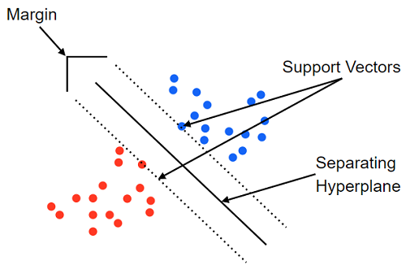

머신 러닝(machine learning) : 컴퓨터가 학습할 수 있게 하는 알고리즘과 기술을 개발하는 분야.

머신 러닝 학습 알고리즘 : 지도 학습(supervised learnig), 비지도 학습(unsupervised learning), 강화 학습(reinforcement learning)

지도 학습 : 분류(classification)에는 K-최근접 이웃, 서포트 벡터 머신, 결정 트리, 로지스틱 회귀), 회귀(regression)에는 선형 회귀

비지도 학습 : 군집(clustering)에는 k-평균 군집화, 밀도 기반 군집 분석), 차원 축소(dimensionality reduction)에는 주성분 분석

강화 학습 : 마르코프 결정 과정

 

 

모델을 정의하는 방법

1. Sequential API : x를 입력받아 y를 출력하는 계층(layer)을 만들어 add()로 계층을 추가하는 형식으로 단순히 층을 여러개 쌓는 형태.
2. Functional API : 입력과 출력을 개발자가 정의해 모델 전체를 규정할 수 있기 때문에 다중 입력과 다중 출력이 가능한 형태. 

 

모델 평가 지표중 정확도 관련 용어

1. True Positive : 모델이 1로 예측을 하고 실제 값도 1인 경우.
2. True Negative : 모델이 0으로 예측을 하고 실제 값도 0인 경우.
3. False Positive : 모델이 1로 예측을 하고 실제 값이 0인 경우, Type 1 오류라고도 함.
4. False Negative : 모델이 0으로 예측을 하고 실제 값이 1인 경우, Type 2 오류라고도 함.

 

 

K-최근접 이웃(K-nearest neighbor) : 새로운 입력을 받았을 때 기존 클러스터에서 모든 데이터와 인스턴스 기반 거리를 측정하고 가장 많은 속성을 가진 클러스터에 할당하는 분류 알고리즘.

 

서포트 벡터 머신(Support Vector Machine) : 분류를 위해 기준선을 정의해 결정 경계(기준선)를 기준으로 어디에 속하는지 분류하는 모델.

서포트 벡터(support vector) : 결정 경계와 가까이 있는 데이터들.

마진(margin) : 결정 경계와 서포트 벡터 사이의 거리.

최적의 결정 경계는 마진을 최대로 해야함.

SVM은 선형 분류와 비선형 분류를 지원하며 비선형 분류를 위해 커널 트릭(kernel trick)이 존재.

선형 분류를 위해서 선형 커널(linear kernel)을 사용하고 비선형 분류를 위해 다항식 커널(polynomial kernel)과 가우시안 RBF 커널(Gaussian RBF kernel)을 사용.

 

