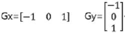
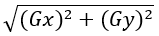
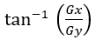
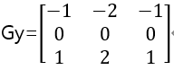
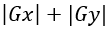

# Filter

### 필터(filter) ###

입력값에서 원하지 않는 값을 걸러내고 원하는 결과를 얻는 작업

**공간 영역 필터(spacial domain filter)** : 새로운 픽셀값을 얻을때 기존 픽셀과 주변 픽셀들을 활용하는 방법.

**주파수 영역 필터(frequency domain filter)** : 픽셀값들의 차이를 주파수로 변환해서 활용하는 방법

**커널(kernel), 마스크(mask)** : 주변 픽셀을 활용할때 어디까지 포함할지와 어떻게 산출할지를 결정하는 것(커널의 크기와 값에 따라 영상을 부드럽게 만들거나 날카롭게 만들거나 엣지를 검출하거나 잡음을 제거하느냐가 결정되며 커널의 크기가 커질수록 연산량이 많아짐).

<br>

**컨볼루션(convolution) 연산**

커널의 각 요소와 대응하는 입력 픽셀값을 곱해서 모두 합한 것을 결과 픽셀값으로 결정하고 해당 작업을 마지막 픽셀까지 반복하는 것.

```python
dst=cv2.filter2D(src, ddepth, kernel [, dst, anchor, delta, borderType])
```

ddepth는 출력 영상의 dtype으로 -1 지정시 src와 같은 타입으로 설정됨.

kernel은 nxn 크기의 float32 배열.

anchor는 커널의 기준점으로 (-1, -1)이 디폴트로 커널의 중앙.

delta는 추가할 값이며 borderType은 가장자리 픽셀 확장 방식을 의미.

borderType(가장자리 픽셀 확장 방법) : BORDER_CONSTANT, BORDER_REPLICATE, BORDER_REFLECT, BORDER_REFLECT_101, BORDER_REFLECT101, BORDER_DEFAULT(=BORDER_REFLECT_101)가 있음.

<br>

**평균 블러링**

블러링이란 영상을 흐릿하게 만드는 것으로 그레이스케일 값 변화가 줄어들어 영상이 부드러워지고 잡음이 사라짐(커널이 커질수록 연산량이 많아짐).

영상의 좌표값을 주변 픽셀값들의 평균으로 적용하는 것.

커널=nxn 크기로 값을 1로 채우고 n**2으로 나눈 행렬.

만든 커널을 cv2.filter2D()의 kernel로 전달하면 됨.

```python
dst=cv2.blur(src, ksize [, dst, anchor, borderType])
```

커널을 만들고 cv2.filert2D()로 적용하는 방법도 있지만 cv2.blur()로 한번에 할 수도 있음.

ksize는 커널의 크기로 (width, height) 형태의 튜플로 지정.

<br>

**가우시안 블러링**

가우시안 분포를 갖는 커널로 블러링을 함.

가까이 있는 픽셀에는 큰 가중치를 설정하고 멀리 있는 픽셀에는 작은 가중치를 사용.

```python
dst=cv2.GaussianBlur(src, ksize, sigmaX, sigmaY, borderType)
```

ksize는 커널 크기로 (0, 0)을 지정하면 sigmaX에 의해 자동으로 결정됨(sigmaX에는 0 대입 불가).

sigmaX, sigmaY는 X, Y 방향 표준편차 SigmaY 생략시 SigmaX와 같은 값 적용됨.

<br>

**미디언 블러링(median blurring)**

커널의 픽셀값중 중간 값(median)으로 대상 픽셀값을 설정하는 것.

소금-후추 잡음 제거에 효과적.

```python
dst=cv2.medianBlur(src, ksize)
```

ksize에 3을 입력시 3x3으로 설정됨.

<br>
**바이레터럴 필터(양방향 필터, bilateral filter)**

가우시안 잡음 제거에 효과적.

가우시안 잡음 제거에는 가우시안 블러링이 효과적이지만 원본 영상의 엣지 정보의 날카로움이 사라질 수 있음 -> 바이레터럴 필터를 사용해서 해결.

가우시안 블러링은 영상 전체를 블러링해 빠르지만 바이레터럴 필터는 엣지가 아닌 부분만 블러링하므로 느림.

```python
dst=cv2.bilateralFilter(src, d, sigmaColor, sigmaSpace [, dst, borderType])
```

d는 필터의 직경으로 -1 입력시 sigmaSpace에 의해 자동으로 결정됨.

sigmaColor는 색 공간에서 필터의 표준 편차.

sigmaSpace는 좌표 공간에서의 필터의 표준 편차.

<br>

### 경계(edge) 검출 ###

**샤프닝(Sharpening)**

영상의 경계(edge, 엣지)를 선명하게 만드는 것으로 경계를 검출해 경계에 있는 픽셀만을 강조하는 것.

경계를 검출하려면 픽셀값의 변화가 크게 일어나는 지점을 찾아야 하는데 이는 미분으로 알 수 있음.

미분 커널은    

그래디언트(gradient) : X축과 Y축에서 값의 변화(기울기)

Gx 커널을 cv2.filter2D()의 kernel에 전달하면 수직(세로 방향) 경계를 검출.

Gy 커널을 cv2.filter2D()의 kernel에 전달하면 수평(가로 방향) 경계를 검출.

그래디언트 크기(magnitude) : 픽셀값의 차이에 비례하며 그래디언트 크기는 

그래디언트 방향(direction) : 픽셀값이 가장 급격하게 증가하는 방향으로 그래디언트 방향은 

그래디언트 크기와 방향은 서로 수직.

<br>

**소벨 필터(Sobel filter)**

수평, 수직, 대각선 경계 검출을 잘하는 필터.

         

```python
dst=cv2.sobel(src, ddepth, dx, dy [, dst, ksize, scale, delta, borderType])
```

ddepth는 출력 영상의 데이터 타입으로 -1 입력시 입력 영상과 동일.

dx, dy, ksize는 x 방향 미분 차수, y 방향 미분 차수, 커널 크기로 보통 dx=1, dy=0, ksize=3이나 dx=0, dy=1, ksize=3을 사용.

scale과 delta는 연산 결과에 추가적으로 곱할 값과 더할 값으로 기본값이 1과 0.

그레이스케일 영상에서 밝은 부분에서 어두운 부분으로 바뀌는 부분의 경우 미분 값이 음수가 나와 전부 0으로 설정됨 -> delta 값 적절히 설정해 해결.

<br>

**캐니 엣지(Canny edge)**

쓰레시홀드 값에 따라 경계(엣지) 검출 대상을 조정할 수 있고 잡음에도 좋아 가장 많이 사용됨.

```py
dst=cv2.Canny(img, threshold1, threshold2 [, edges, apertureSize, L2gradient])
```

img는 입력 영상으로 가급적 그레이스케일 영상이 좋음.

threshold1과 threshold2는 최소, 최대 임계값.

apertureSize는 소벨 연산에 사용할 커널 크기로 기본값이 3.

L2gradient는 그레디언트 크기를 구할 방식으로 기본값이 False.

True는  로 정확하지만 느리고 False는 로 빠르지만 True보단 부정확함.

<br>

### 모폴로지(Morphology) ###

노이즈 제거, 구멍 메꾸기, 연결되지 않은 경계 이어 붙이기 등 형태학적 관점에서 영상을 다루는 기법.

전처리(pre-processing)나 후처리(post-processing) 형태로 사용됨.

이진 영상을 대상으로 함.

0과 1로 채워진 커널인 구조화 요소(structuring element)를 각 영상의 픽셀에 적용함.

```python
k=cv2.getStructuringElement(shape, ksize [, anchor])
```

shape은 구조화 요소 커널의 모양으로 cv2.MORPH_RECT는 사각형, cv2.MORPH_ELLIPSE는 타원형, cv2.MORPH_CROSS는 십자형.

ksize는 커널의 크기로 (width, height)의 튜플로 전달.

anchor는 구조화 요소의 기준점 좌표로 기본값이 중심점(-1, -1).

k는 0과 1로 구성된 cv2.CV_8UC1 타입 행렬.

<br>

**침식(erosion)**

객체 영역을 깍아내는 연산으로 객체의 크기가 감소하며 잡음 제거에 효과적.

입력 영상에 구조화 요소를 적용해 구조화 요소의 1로 채워진 부분이 입력 영상의 부분에 의해 다 겹치지 않으면 anchor point를 0으로 변경.

```pyth
dst=cv2.erode(src, kernel [, anchor, iterations, borderType, borderValue])
```

kernel에 getStructuringElement()로 리턴받은 커널을 전달해도 되지만 NONE 입력시 3x3 사각형 구조화 요소를 사용.

anchor는 구조화 요소의 기준점 좌표로 기본값이 중심점(-1, -1).

iterations는 침식 연산을 반복할 횟수로 기본값은 1.

borderType은 외곽 영역 보정 방법이며 borderValue는 외곽 영역 보정 값.

<br>

**팽창(dilation)**

객체 영역을 확장하는 연산으로 객체의 크기가 확장되며 잡음도 확장됨.

입력 영상에 구조화 요소를 적용해 구조화 요소화 입력 영상이 한 부분이라도 겹쳐지면 anchor point를 1로 변경.

```python
dst=cv2.dilate(src, kernel [,dst, anchor, iterations, borderType, borderValue])
```

cv2.erode()와 동일한 사용법.

<br>

**열기(Opening), 닫기(Closing)**

원래의 모양을 제거하면서 노이즈 제거가 가능.

열기 : 침식 연산 적용 후 팽창 연산을 적용한 것으로 밝은 노이즈 제거에 효과적이며 작거나 돌출된 픽셀 제거에 효과적.

닫기 : 팽창 연산 적용 후 침식 연산을 적용한 것으로 어두운 노이즈 제거에 효과적이며 구멍을 메우거나 끊어져 보이는 픽셀을 연결하는데 효과적.

```py
dst=cv2.morphologyEx(src, op, kernel [, dst, anchor, iteration, borderType, borderValue])
```

| op                 | 모폴로지 연산 종류                                        |
| ------------------ | --------------------------------------------------------- |
| cv2.MORPH_OPEN     | 열기 연산                                                 |
| cv2.MORPH_CLOSE    | 닫기 연산                                                 |
| cv2.MORPH_GRADIENT | 그레이디언트 연산(팽창 - 침식으로 경계를 얻을 수 있음)    |
| cv2.MORPH_TOPHAT   | 탑햇 연산(원본 영상 - 열기 연산으로 밝은 부분을 강조)     |
| cv2.MORPH_BLACKHAT | 블랙햇 연산(원본 영상 - 닫기 연산으로 어두운 부분을 강조) |


