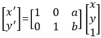
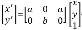
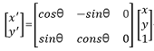

# Geometric transform

기하학적 변환 : 영상 좌표에 기하학적인 연산을 통해 새로운 좌표를 얻거나 영상의 모양을 바꾸는 것

<br>

**영상의 좌표를 변환시키는 함수**

```python
dst=cv2.warpAffine(src, mtrx, dsize[, dst, flags, borderMode, borderValue])
```

dtype이 float32인 2x3 변환 행렬을 mtrx에 전달하고 결과 영상의 크기를 (width, height)로 dsize에 전달. 

(0, 0) 전달시 입력 영상과 동일한 크기로 설정.

<br>

**이동**

영상을 가로, 세로 방향으로 특정 크기만큼 이동시키는 변환으로 이동시키려는 거리를 지정해야함.

새로운 좌표 (x', y')에 대해 x'=x+a, y'=y+b로 표현가능하고 이를 행렬식으로 바꾸면 

<br>

**확대/축소**

영상을 확대/축소하려는 가로/세로 비율을 지정해야함.

x'=a*x, y'=b*y로 표현가능하고 이를 행렬식으로 바꾸면 

```python
dst=cv2.resize(src, dsize, dst, fx, fy, interpolation)
```

변환 행렬을 생성해 warpAffine()을 호출하지 않아도 resize()로 확대/축소 가능.

결과 영상의 크기를 (width, height)로 dsize에 전달하며 (0, 0) 전달시 fx와 fy를 적용.

x와 y의 크기 배율을 지정하며 생략하면 dsize를 적용.

<br>

**회전**

기존의 (x, y)를 (x', y')로 회전시켜 이동하는 것으로 행렬식으로 표현시 

```python
mtrx=cv2.getRotationMatrix2D(center, angle, scale)
```

회전 축 중심 좌표를 튜플(x, y)로 center에 전달하며 회전 각도를 60진법으로 angle에 전달. 반시계 방향 기준이며 시계 방향으로 원할시 음수로 지정.

확대/축소 비율을 scale에 전달하면 변환 행렬을 mtrx로 리턴해 cv2.warpAffine()에 전달하면 됨.

<br>

**어파인 변환(Affine transform)**

이동, 확대/축소, 회전 변환으로 직선, 길이의 비율, 평행성을 보존하는 변환.

변환 전과 변환 후의 3개의 점을 짝지어 매핑할 수 있다면 변환 행렬을 거꾸로 계산할 수 있음.

```python
matrix=cv2.getAffineTransform(pts1, pts2)
```

변환 전 영상의 좌표 3개(3x2 크기의 numpy 배열로 float32 타입)를 pts1에 전달하고 변환 후 영상의 좌표 3개(pts1과 같은 크기와 타입)를 pts2에 전달하면 변환 행렬을 반환해줌(2x3 행렬).

<br>

**원근 변환(Perspective transform), 투시 변환**

```python
mtrx=cv2.getPerspectiveTransform(pts1, pts2)
```

원근 변환(투시 변환)은 원근감을 주는 변환으로 변환 전 영상의 좌표 4개(4x2 크기의 Numpy 배열로 float32 타입)를 pts1에 전달하고 변환 후 영상의 좌표 4개(pts1과 같은 크기와 타입)를 pts2에 전달하면 변환 행렬을 반환해줌(3x3 행렬).

```python
dst=cv2.warpPerspective(src, mtrx, dsize[, dst, flags, borderMode, borderValue])
```

cv2.warpAffine()과 매개변수가 동일하지만 cv2.warpPerspective()는 mtrx가 3x3 행렬임.

<br>

**리매핑**

특정 위치 픽셀을 다른 위치로 재배치하여 어파인 변환, 원근 변환 등의 변환을 리매핑으로도 표현 가능.

```python
dst=cv2.remap(src, mapx, mapy, interpolation [, dst, borderMode, borderValue])
```

mapx와 mapy는 x축과 y축으로 이동할 좌표로 src와 크기가 같아야 하며 타입은 np.float32.

mapx[0] [0]=10, mapy[0] [0]=5는 src의 (0, 0) 좌표를 (10, 5)로 옮기라는 의미. 

나머지 인자는 cv2.warpAffine()과 동일.


